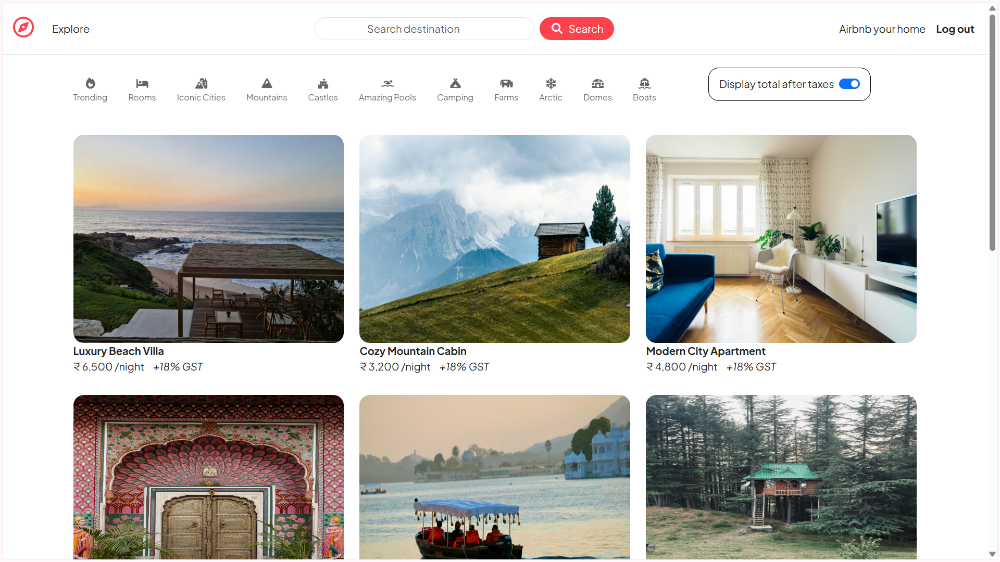
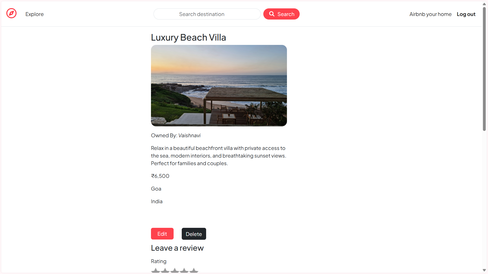
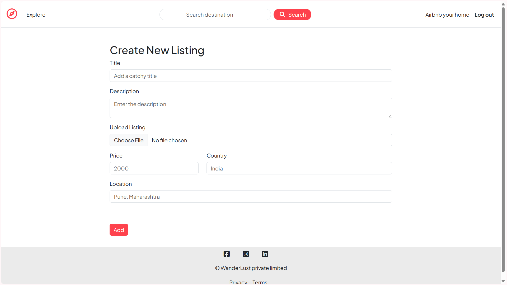
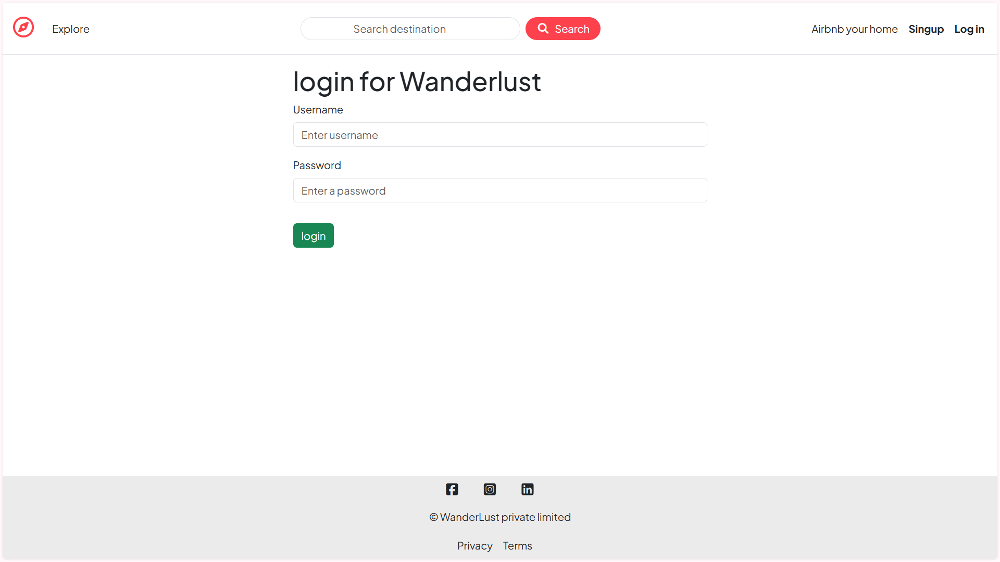

# 🌍 WanderLust

A full-stack Airbnb-inspired web application for discovering, listing, and reviewing travel stays.

Built using **Node.js**, **Express.js**, **MongoDB Atlas**, **EJS**, and **Cloudinary**, WanderLust allows users to create travel listings, upload images, write reviews, and securely authenticate using Passport.js.

---

## 🚀 Live Demo

🔗 **Live Website:** [https://YOUR-RENDER-URL.onrender.com](https://wanderlust-0v4z.onrender.com/listings)

---

## ✨ Features

- 🔐 User Authentication (Register/Login/Logout)
- 🏠 Create, Edit and Delete Listings
- 🖼️ Upload Listing Images using Cloudinary
- ⭐ Add and Delete Reviews
- 👤 Authorization (Only owners can edit/delete their listings)
- 💬 Flash Messages for User Feedback
- 🔒 Secure Sessions using MongoDB Session Store
- ☁️ Cloud Image Storage with Cloudinary
- 📱 Responsive User Interface
- 🌐 Deployed on Render

---

## 🛠️ Tech Stack

### Frontend

- EJS
- HTML5
- CSS3
- Bootstrap 5
- JavaScript

### Backend

- Node.js
- Express.js

### Database

- MongoDB Atlas
- Mongoose

### Authentication

- Passport.js
- Passport Local
- Passport Local Mongoose

### Image Storage

- Cloudinary
- Multer
- Multer Storage Cloudinary

### Deployment

- Render

---

## 📂 Project Structure

```
WanderLust/
│
├── controllers/
├── models/
├── routes/
├── views/
├── public/
├── utils/
├── middleware.js
├── app.js
├── cloudConfig.js
├── schema.js
├── package.json
└── README.md
```

---

## ⚙️ Installation

Clone the repository

```bash
git clone https://github.com/Vaishnavi12-git/WanderLust.git
```

Navigate into the project

```bash
cd WanderLust
```

Install dependencies

```bash
npm install
```

Create a `.env` file and add:

```env
ATLASDB_URL=your_mongodb_connection_string

SECRET=your_session_secret

CLOUD_NAME=your_cloudinary_name
CLOUD_API_KEY=your_cloudinary_api_key
CLOUD_API_SECRET=your_cloudinary_api_secret
```

Run the application

```bash
node app.js
```

or

```bash
nodemon app.js
```

---

## 📸 Screenshots

### Home Page



### Listing Details



### Create Listing



### Login Page



---

## 📚 What I Learned

This project helped me gain hands-on experience with:

- RESTful Routing
- MVC Architecture
- Authentication & Authorization
- Session Management
- MongoDB Atlas
- Image Upload using Cloudinary
- Express Middleware
- CRUD Operations
- Deployment using Render
- Git & GitHub Workflow

---

## 🔮 Future Improvements

- 🔍 Search Functionality
- 🏷️ Category Filters
- ❤️ Wishlist
- 📍 Interactive Maps
- 📅 Booking Calendar
- 💳 Online Payments
- 📱 React Frontend
- ⚡ MERN Stack Conversion

---

## 👩‍💻 Author

**Vaishnavi Kale**